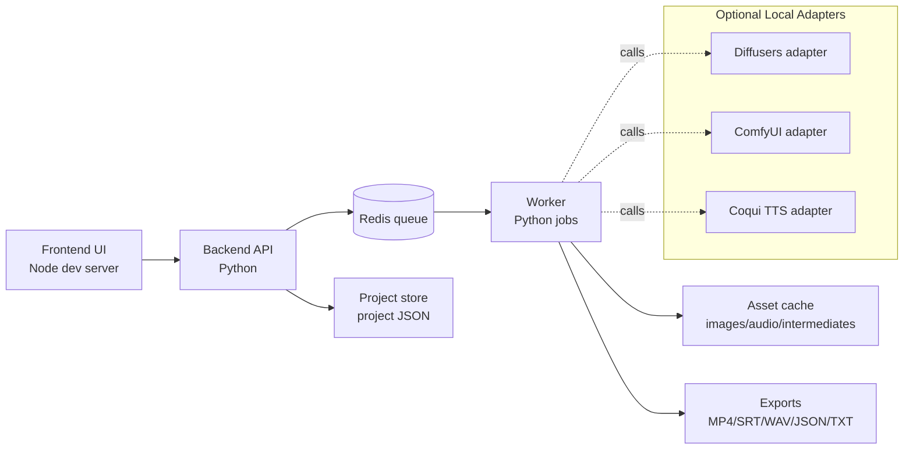

# Video Story Studio (Local-First)

Video Story Studio is a local-first pipeline for turning scripts into narrated, scene-based videos with editable project metadata and reproducible exports.

The project is designed so you can:
- Draft a story script.
- Split the script into scene chunks.
- Generate (or mock) visuals and voiceover per scene.
- Compose timeline outputs into final media exports.
- Re-open and re-export from a portable project JSON.

## Local-first guarantees

This repository is intended to run fully on your own machine.

- **Default behavior is offline-friendly**: mock providers are enabled by default and require no cloud API keys.
- **Data ownership**: scripts, generated assets, and project metadata remain on local disk unless you explicitly add remote integrations.
- **Deterministic project state**: project JSON captures scene plan, provider settings, and output mappings so jobs can be re-run or audited.
- **Graceful degradation**: if GPU/model services are unavailable, the system can fall back to CPU and/or mock paths rather than hard failing.

## Architecture



### High-level flow

1. Frontend submits script + settings to backend.
2. Backend creates a project, chunks story text, and enqueues jobs in Redis.
3. Worker processes scene jobs (mock or real adapters).
4. Worker writes media artifacts and updates project state.
5. Exporter assembles timeline outputs (MP4, SRT, WAV, prompt manifests).

## Prerequisites

Install these locally before running the stack:

- **Python** 3.10+
- **Node.js** 18+
- **Redis** 6+
- **ffmpeg** 5+

### Verify prerequisites

```bash
python --version
node --version
redis-server --version
ffmpeg -version
```

## Quickstart

> The commands below use generic service names (`backend`, `frontend`, `worker`). Adjust to your actual scripts if different.

### 1) Clone and configure

```bash
git clone <your-fork-or-repo-url> video-story-studio
cd video-story-studio
cp .env.example .env
```

### 2) Start Redis

```bash
redis-server
```

### 3) Start backend (Python)

```bash
# in terminal A
python -m venv .venv
source .venv/bin/activate
pip install -r requirements.txt
python -m backend.app
```

### 4) Start worker (Python)

```bash
# in terminal B
source .venv/bin/activate
python -m worker.main
```

### 5) Start frontend (Node)

```bash
# in terminal C
npm install
npm run dev
```

Open the local frontend URL shown in terminal C (commonly `http://localhost:5173`).

## Environment configuration (`.env`)

Use this table as a baseline. Keep mock mode on for zero-friction startup.

| Variable | Required | Default | Purpose |
|---|---|---:|---|
| `APP_ENV` | No | `development` | Runtime profile for backend/worker logging and behavior. |
| `BACKEND_HOST` | No | `0.0.0.0` | Bind address for backend API server. |
| `BACKEND_PORT` | No | `8000` | Backend API port. |
| `FRONTEND_PORT` | No | `5173` | Local frontend dev-server port. |
| `REDIS_URL` | Yes | `redis://localhost:6379/0` | Queue and pub/sub connection string. |
| `MEDIA_ROOT` | No | `./data/media` | Root folder for generated scene assets. |
| `EXPORT_ROOT` | No | `./data/exports` | Root folder for export outputs. |
| `PROJECT_ROOT` | No | `./data/projects` | Folder for project JSON snapshots. |
| `FFMPEG_BIN` | No | `ffmpeg` | ffmpeg executable path if not on `PATH`. |
| `MOCK_MODE` | No | `true` | Enables built-in mock providers for image/audio generation. |
| `IMAGE_PROVIDER` | No | `mock` | `mock`, `diffusers`, or `comfyui`. |
| `TTS_PROVIDER` | No | `mock` | `mock` or `coqui`. |
| `DEVICE` | No | `auto` | `auto`, `cuda`, `mps`, or `cpu`. |
| `CHUNK_TARGET_CHARS` | No | `900` | Target story chunk size per scene. |
| `CHUNK_MAX_CHARS` | No | `1400` | Hard cap for chunk size before forced split. |
| `LOG_LEVEL` | No | `INFO` | Logging verbosity. |

## Model setup

### Default: mock mode (works immediately)

Out of the box, keep:

```env
MOCK_MODE=true
IMAGE_PROVIDER=mock
TTS_PROVIDER=mock
```

This mode:
- requires no model downloads,
- validates end-to-end orchestration,
- generates placeholder image/audio artifacts for UI and export testing.

### Optional local model adapters

Disable `MOCK_MODE` and select adapters only after local dependencies are ready.

#### A) Diffusers image adapter

1. Install PyTorch + diffusers stack matching your hardware.
2. Set:
   ```env
   MOCK_MODE=false
   IMAGE_PROVIDER=diffusers
   DEVICE=auto
   ```
3. Configure model path/name your backend expects (for example via `DIFFUSERS_MODEL_ID`).
4. Restart backend + worker.

#### B) ComfyUI image adapter

1. Run a local ComfyUI server and verify API access.
2. Set:
   ```env
   MOCK_MODE=false
   IMAGE_PROVIDER=comfyui
   ```
3. Point backend/worker to ComfyUI endpoint (for example `COMFYUI_BASE_URL=http://127.0.0.1:8188`).
4. Restart backend + worker.

#### C) Coqui TTS adapter

1. Install Coqui TTS and download/prepare a supported local voice model.
2. Set:
   ```env
   MOCK_MODE=false
   TTS_PROVIDER=coqui
   ```
3. Provide adapter-specific voice/model variables expected by your worker.
4. Restart backend + worker.

## Truthful limitations of mock providers

Mock providers are intentionally limited and **do not approximate production quality**:

- Visual outputs are placeholders (solid/background patterns + text overlays), not semantically generated imagery.
- Audio outputs are simple tones/synthetic placeholders, not natural speech.
- Prompt fidelity cannot be evaluated in mock mode.
- Runtime/performance in mock mode is not representative of real model inference.
- Lip-sync, timing naturalness, and pronunciation correctness are not validated.

### Replace mocks with real providers (exact sequence)

1. Install and verify prerequisites for the target adapter(s): Diffusers and/or ComfyUI for images, Coqui for TTS.
2. Confirm the adapter endpoint/model runs independently (outside this app).
3. In `.env` set `MOCK_MODE=false`.
4. Set `IMAGE_PROVIDER` and `TTS_PROVIDER` to the desired real adapter(s).
5. Add any adapter-specific variables (model id, endpoint URL, voice id).
6. Restart backend and worker.
7. Run a small test script first, inspect generated assets, then scale workload.

## Export formats

The exporter can emit one or more of the following artifacts:

- **MP4 (`.mp4`)**: final composed video timeline with scene visuals and narration.
- **Project JSON (`.json`)**: canonical project state (inputs, scene chunks, provider settings, artifact paths).
- **Subtitles SRT (`.srt`)**: per-scene/per-line subtitle timing for playback and editing.
- **Narration WAV (`.wav`)**: mixed narration master or per-scene stems depending on config.
- **Prompt manifest TXT (`.txt`)**: plain text prompt log for review.
- **Prompt manifest JSON (`.json`)**: structured prompt/parameter record for reproducibility.

## Troubleshooting

### `ffmpeg` not found

Symptoms:
- export tasks fail immediately,
- logs show `FileNotFoundError: ffmpeg` or non-zero ffmpeg spawn errors.

Fix:
1. Install ffmpeg.
2. Verify with `ffmpeg -version`.
3. If needed, set explicit binary path:
   ```env
   FFMPEG_BIN=/absolute/path/to/ffmpeg
   ```
4. Restart backend and worker.

### Redis connection errors

Symptoms:
- backend accepts requests but jobs never start,
- worker logs show connection refused/timeouts.

Fix:
1. Confirm Redis is running: `redis-cli ping` should return `PONG`.
2. Validate `REDIS_URL` in `.env`.
3. Check host/port and firewall/container networking.
4. Restart backend + worker after updating `.env`.

### Missing GPU fallback behavior

If no CUDA/MPS device is available, runtime should fall back to CPU (or mock mode when enabled).

Recommended settings:

```env
DEVICE=auto
MOCK_MODE=true   # safest fallback for first run
```

If you require real models on CPU-only systems, expect significantly slower processing and reduce chunk size/workload.

### Long story chunking behavior

Very long scripts are split into scene chunks to keep prompt/context and job durations manageable.

- `CHUNK_TARGET_CHARS` guides typical scene size.
- `CHUNK_MAX_CHARS` enforces a hard cap and forces additional splitting.
- Larger chunks may improve narrative continuity but increase per-job latency and memory pressure.
- Smaller chunks improve reliability but may require stronger transition prompts between scenes.

## Example inputs

Use ready-made samples in `examples/`:

- Script text: `examples/demo_script.txt`
- Project payload: `examples/demo_project.json`

These examples are intended for quick smoke testing in mock mode.
